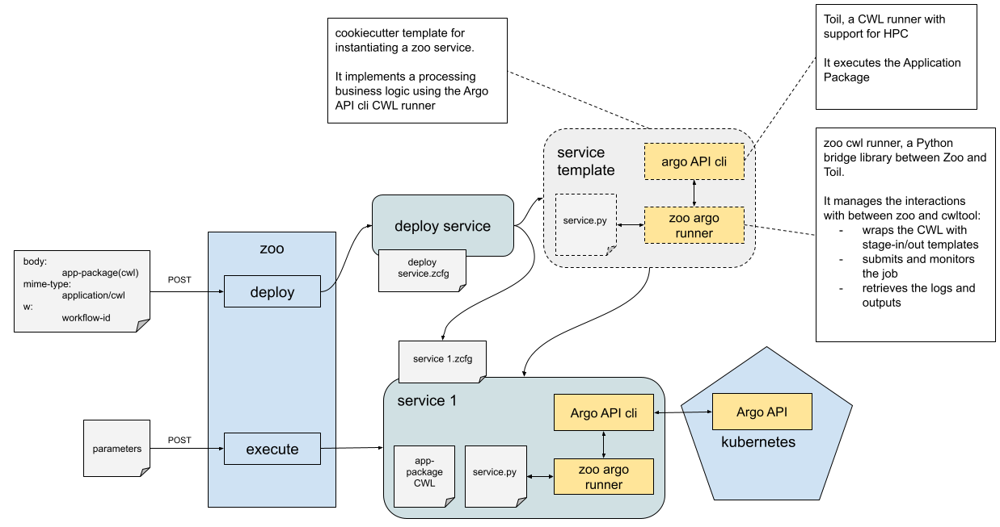

# Argo Workflows Processing Runners

Argo Workflows, with its container-native workflow engine, is adept at managing intricate job dependencies and facilitating the execution of multiple Kubernetes pods in parallel. 

This makes it an ideal candidate for integration as a Processing Runner in EO platforms, especially given the complex nature of EO data processing, which often involves extensive data manipulation
and analysis pipelines.

Argo Workflows is distinguished by its ability to support scalable and efficient tasks, accommodating various data artefacts in the process. Its seamless integration with Kubernetes
harnesses the power of pods, secrets, and volumes, enhancing its capacity to manage large-scale workflows. This compatibility with Kubernetes infrastructure not only streamlines workflow execution but also ensures that Argo Workflows can leverage the full spectrum of Kubernetes features to optimise processing tasks. 

Integrating Argo Workflows as a Processing Runner promises several benefits:

- Enhanced orchestration capabilities for complex EO data processing tasks.
- Improved scalability and efficiency, enabling the EO platform to handle larger datasets and more sophisticated processing workflows.
- Greater flexibility in managing job dependencies, facilitating more complex analyses and machine learning pipelines.

The integration of Argo Workflows as a Processing Runner for Zoo is depicted below.

