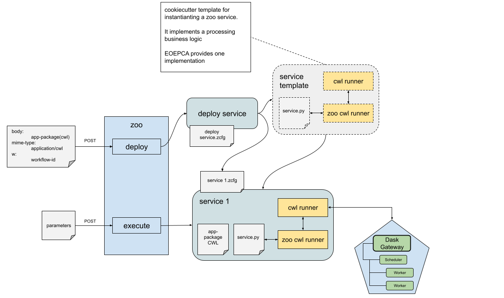

# Dask Processing Runner

Dask, a flexible parallel computing library for analytic computing, is especially well-suited for tasks that are common in EO, such as large-scale image processing, data manipulation, and machine learning. 

The Dask Processing Runner may become an essential component in the landscape of EO data processing, particularly for its role in enhancing the handling and analysis of large-scale, complex datasets and other aspects like:

* Handling Large Datasets Efficiently: Dask's ability to process large datasets that do not fit into the memory of a single machine is a significant advantage. It achieves this by breaking down large computations into smaller, manageable tasks and distributing them across a cluster. This approach is vital for EO data, which can be voluminous and complex.
* Parallel Processing Capabilities: Dask excels in parallel data processing, allowing for faster analysis and computation. This is crucial in EO where time-sensitive data analysis is often required, such as in environmental monitoring or disaster response scenarios.
* Scalability and Flexibility: Dask  provides scalability, allowing EO data processing workflows to scale up or down based on the computational needs. This flexibility is important in meeting the varying demands of different EO projects, ensuring efficient use of resources.
* Integration with Python Ecosystem: Dask integrates with the existing Python data science ecosystem, which is widely used in the EO community. This allows for the use of familiar tools and libraries, thereby reducing the learning curve and enabling more straightforward implementation of processing workflows.

Dask offers a scalable approach to data processing, adept at handling large datasets that exceed the memory limitations of individual machines. It achieves this through intelligent task scheduling and distributed computing. Dask’s compatibility with Python's data science stack makes it a natural choice for integration into existing EO workflows, which often rely on Python-based tools and libraries.

The integration of Dask with Zoo is depicted below.

