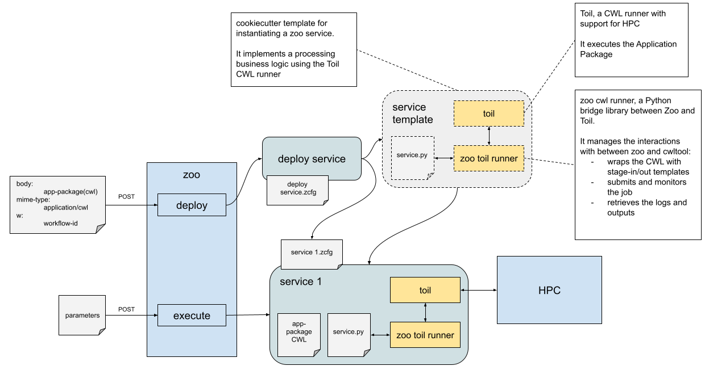

# High-Performance Computing (HPC) Processing Runner

HPC systems are designed to handle and process large-scale data computations, making them highly suitable for the data-intensive nature of EO processing tasks. The use of HPC can significantly reduce processing time for complex computations, thereby increasing efficiency and throughput. In this context, Slurm emerges as a powerful and flexible workload manager. 

It enables effective job scheduling, resource allocation, and cluster management, which are crucial for optimising the performance of HPC environments in processing EO data.

In the case of the OGC API Processes using Application Packages, the design follows the same model as used for the Kubernetes/Calrissian runner but the CWL runner is Toil since it support Slurm.

The design is depicted below:

