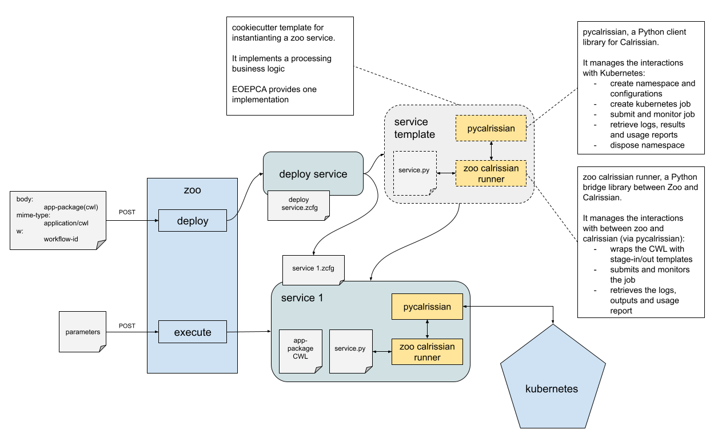

# Kubernetes Processing Runner

The role of Kubernetes as a Processing Runner in the EO platforms is becoming increasingly vital because of its orchestration capabilities that play a crucial role in managing containerized applications and workloads. 

Its use as a Processing Runner is pivotal in achieving high levels of scalability, reliability, and efficiency in data processing tasks.

Kubernetes facilitates the management of complex processing tasks by efficiently handling container deployment, scaling, and operation. This is particularly important in the context of EO, where processing workloads can be highly variable and resource-intensive. As the demand for processing EO data grows, the need for a scalable and flexible infrastructure becomes critical.

Kubernetes addresses this need by enabling dynamic horizontal scaling of resources, ensuring that processing capabilities can be ramped up or down based on real-time requirements, thereby optimising resource utilisation and reducing operational costs.

The Kubernetes processing runner relies on Calrissian, which is a CWL (Common Workflow Language) runner designed to operate on Kubernetes clusters. It allows users to execute CWL workflows in a cloud-native environment, taking advantage of Kubernetes for orchestrating and scaling complex computational workflows. Calrissian offers a powerful platform for executing CWL workflows on Kubernetes, providing scalability, resource efficiency, and the ability to handle complex, data-intensive computational tasks.

The integration of Calrissian as the CWL runner for Kubernetes with Zoo is depicted below.

